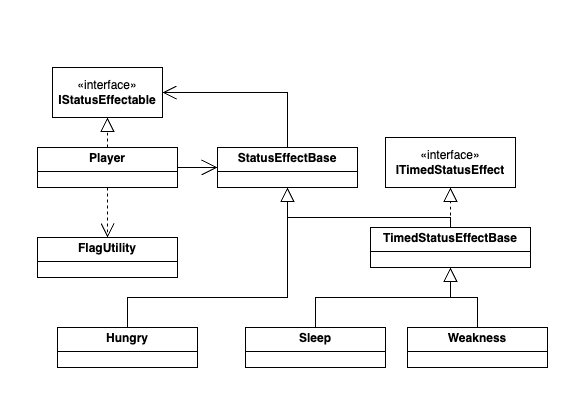
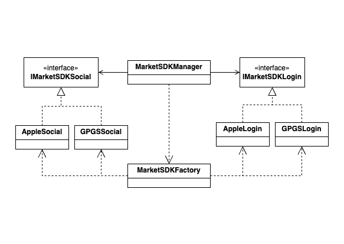

# Shim YuJin's Unity Portfolio

### 구성
1. **StatusEffect** - 게임 캐릭터의 상태 이상(ex. 수면, 쇠약) 로직
2. **MarketSDK**    - Google PlayStore, Apple AppStore 등 마켓에서 제공하는 Social 기능 SDK 사용 로직

## 1. StatusEffect

#### - 클래스 구조

#### - 작업 시 고려 사항

* 코드의 결합도를 낮추기 위하여 캐릭터에게서 상태 이상이 활성화, 비활성화될 때 event를 사용하여 상태를 전달함

* 코드의 확장, 유지보수를 위하여 interface를 이용한 기능의 분리 및 조합을 활용함

* bit Flag를 이용하여 상태를 저장 및 구분하는 방식을 사용하여 메모리를 최적화 함

#### - 사용 예시

## 2. MarketSDK

#### - 클래스 구조

#### - 작업 시 고려 사항

* interface를 사용하여 필수 요소를 정의하고, 각 마켓 SDK에서 구현하여 마켓 SDK의 버전 업데이트 시 게임 로직에는 영향이 가지 않고
수정할 수 있도록 작업함

* 출시 마켓 추가와 기능 추가를 고려하여 Factory Pattern 방식으로 마켓 별 객체를 생성하고 관리할 수 있도록 작업함
